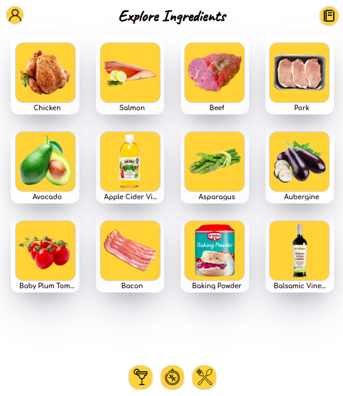

Este projeto contém os requisitos realizados por _[Anna Beatriz Garcia Trajano de Sá](www.linkedin.com/in/anna-beatriz-trajano-de-sá)_ enquanto estudava na [Trybe](https://www.betrybe.com/) :rocket:

# Project Recipes App

Neste projeto desenvolvi um app de receitas, utilizando o que há de mais moderno dentro do ecossistema React: Hooks e Context API!

Nele será possível ver, buscar, filtrar, favoritar e acompanhar o progresso de preparação de receitas e drinks!

A base de dados serão duas APIs distintas, uma para comidas e outra para bebidas.

Veja o exemplo a seguir do layout do projeto!

## Layout

Login Page            |  Food's Page    
:-------------------------:|:-------------------------:
  |  

Drink's Page           |  Details Page
:-------------------------:|:-------------------------:
  |  

Progress Page           |  Favorite Page
:-------------------------:|:-------------------------:
  |  

Explore Nationalities          |  Explore Ingredients
:-------------------------:|:-------------------------:
  |  

 ## Link para o deploy:
 
 [Cook Like a Dev!](https://project-recipes-app-alpha.vercel.app/) 

## Habilidades Desenvolvidas

Neste projeto, desenvolvi as seguintes habilidades:

 - Utilizar Redux para gerenciar estado
 - Utilizar a biblioteca React-Redux
 - Utilizar a Context API do React para gerenciar estado
 - Utilizar o React Hook useState
 - Utilizar o React Hook useContext
 - Utilizar o React Hook useEffect
 - Criar Hooks customizados
 
 ## Referências
 [TheMeal DB ](https://www.themealdb.com/api.php) 
 [The CockTailDB API ](https://www.thecocktaildb.com/api.php) 
 [Documentação oficial do React sobre Context API](https://reactjs.org/docs/context.html) 
 [API de Referência dos Hooks](https://pt-br.reactjs.org/docs/hooks-reference.html) 
 [React Icons](https://react-icons.github.io/react-icons/) 

## Escopo do Projeto

 - Tela de Login
 - Header
 - Barra de busca
 - Menu inferior
 - Tela principal de receitas
 - Tela de detalhes de uma receita
 - Tela de receita em progresso
 - Tela de receitas feitas
 - Tela de receitas favoritas
 - Tela de explorar
 - Tela de explorar bebidas ou comidas
 - Tela de explorar ingredientes
 - Tela de explorar por nacionalidades
 - Tela de perfil

